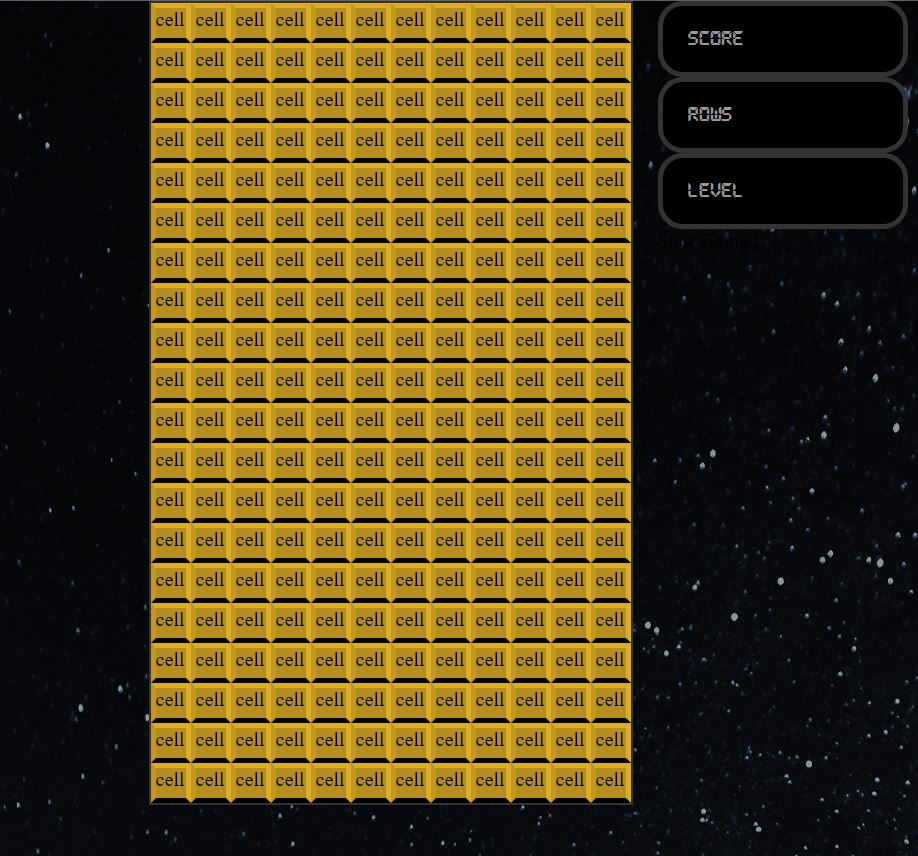
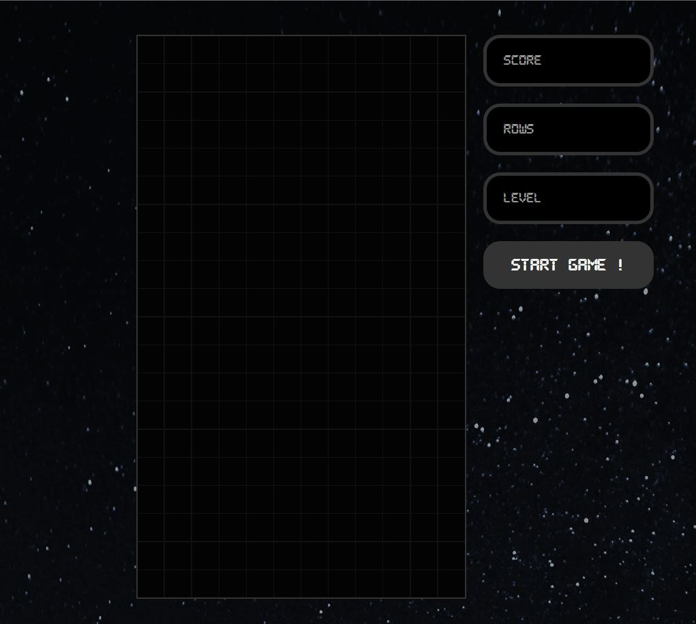
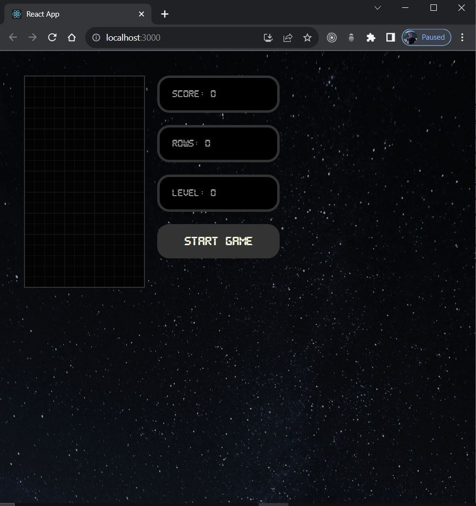
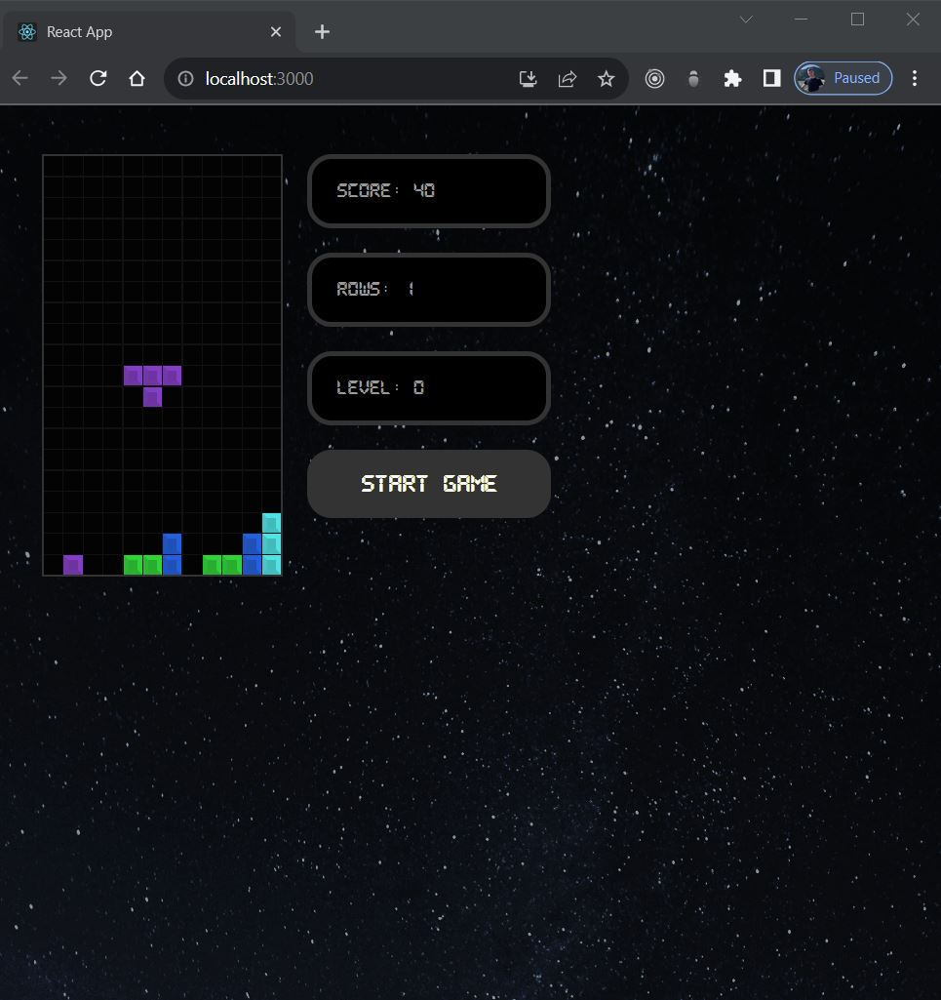

## Tetris-Game
- This repository contains the source code for a Tetris game implemented in React. The game features a playable Tetris interface with keyboard controls for moving and rotating tetrominoes. It utilizes custom React hooks and styled components for building the game logic and user interface.

### Getting Started
- To run the Tetris game on your local machine, follow these steps:

Clone the Repository:

Clone this repository to your local machine using your preferred method (HTTPS or SSH):

1. Copy code
`git clone https://github.com/Francys04/Tetris_game_JS`

Navigate to the Directory:

2. Change your working directory to the cloned repository's folder:

Copy code
`cd tetris-game`

3. Install Dependencies:

Install the required dependencies using a package manager like npm or yarn. If you use npm:

Copy code
npm install
If you use yarn:

Copy code
yarn install
Run the Game:

### Start the development server to run the Tetris game:

1. Copy code
`npm start`

This will launch the game in your default web browser. You can start playing by using the keyboard arrow keys for movement and rotation.

### Game Features
1. Keyboard Controls: Use the arrow keys for movement (left, right, down) and rotation (up).
2. Score and Level: The game keeps track of your score, the number of cleared rows, and the current level.
3. Automatic Movement: The tetrominoes automatically move downward at a progressively faster rate as the game level increases.
4. Game Over: When the tetrominoes reach the top of the game area, the game is over, and you can start a new game.
### Components
#### Tetris Component
- The Tetris component is the main component that orchestrates the game. It imports various custom hooks and components to manage the game state and user interactions. Here's a breakdown of what this component does:

- State Management: Manages various states such as drop time, game over status, player's position, game stage, score, rows, and level using useState hooks.

- User Input Handling: Captures keyboard events for user input (arrow keys and spacebar) to move and rotate the tetromino using the move function.

- Game Loop and Interval: Uses the useInterval hook to create the game loop that handles the automatic downward movement of the tetromino.

- Collision Detection: Uses the checkCollision function to detect collisions between the current tetromino and the game stage.

- Game Logic: The drop function handles the automatic downward movement of the tetromino. It also increases the game level and speed as rows are cleared. If the player reaches the top of the stage, the game ends.

- Rendering: Renders the game stage using the Stage component and displays game information (score, rows, level, and start button) using the Display component.

- StartButton Component
The StartButton component is a simple styled button that triggers the game to start when clicked. It takes a callback prop that represents the function to be executed when the button is clicked.

- Stage Component
The Stage component renders the game stage using a 2D array. It maps through the stage array and renders each cell using the Cell component.

- Display Component
The Display component displays game-related information such as the score, rows cleared, and level. If the game is over, it displays a "Game Over" message. The appearance of the display area changes based on the gameOver prop.

- Cell Component
The Cell component represents a single cell in the game stage. It receives a type prop that specifies the type of tetromino block to display in the cell.

### Custom Hooks
- useGameStatus
The useGameStatus hook manages the game-related statistics, including the score, rows cleared, and level. It calculates the score based on the number of cleared rows and the current level.

- useInterval
The useInterval hook is used to create an interval that triggers a given callback function with a specified delay.

- usePlayer
The usePlayer hook manages the player's state, including position, tetromino shape, and collision status. It provides functions to update the player's position, reset the player's state, and rotate the player's tetromino.

- useStage
The useStage hook manages the game stage. It updates the stage based on the player's actions, such as moving and rotating tetrominos. It also detects when rows are cleared and updates the rowsCleared state.

- GameHelpers Module
The gameHelpers module contains utility functions and constants used in the game:

- STAGE_WIDTH and STAGE_HEIGHT constants define the size of the game stage.

- createStage function generates an empty game stage using a 2D array.

- checkCollision function checks for collisions between the player's tetromino and the game stage.

### Tetrominos Module
The tetrominos module defines different tetromino shapes and colors. Tetrominos are represented using uppercase letter names (I, J, L, O, S, T, Z) and have corresponding shape patterns and colors.

## How to Run
1. Make sure you have Node.js and npm installed on your machine.
2. Clone the project repository.
3. Open a terminal window and navigate to the project directory.
4. Run npm install to install the project dependencies.
5. Run npm start to start the development server.
6. Open your web browser and go to http://localhost:3000 to play the Tetris game.

## Enjoy !!!
- Create style, structure of cell (rows and colomns) of this game

- Set empty cell and define last characteristics

- Define logical alghoritms

- Start the game
